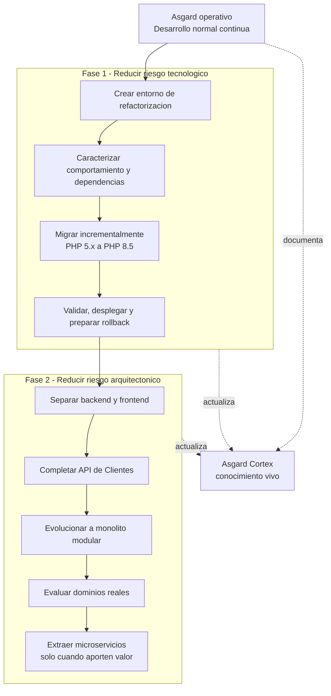
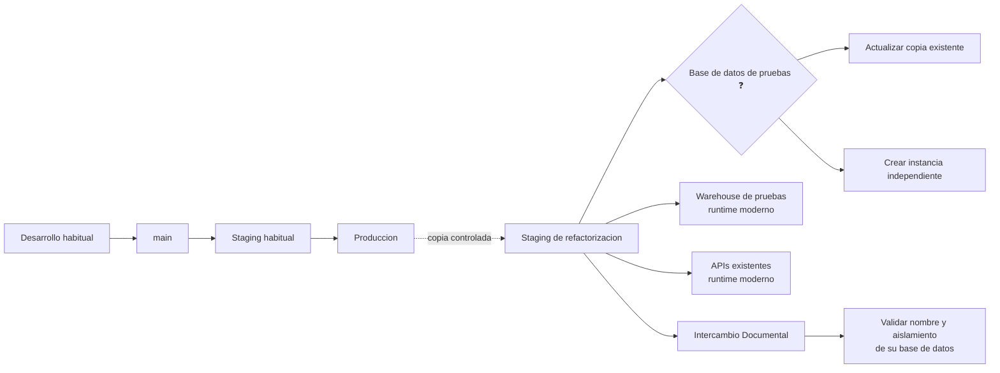
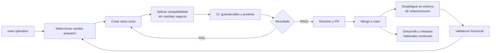
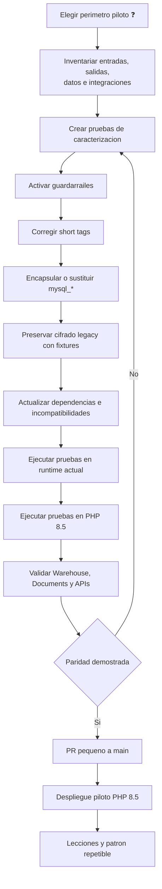
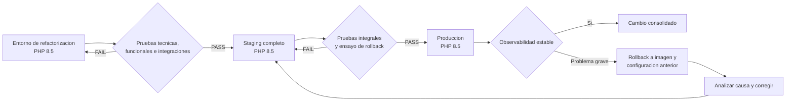
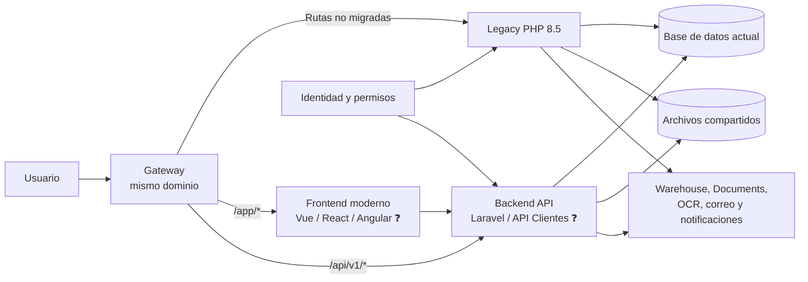
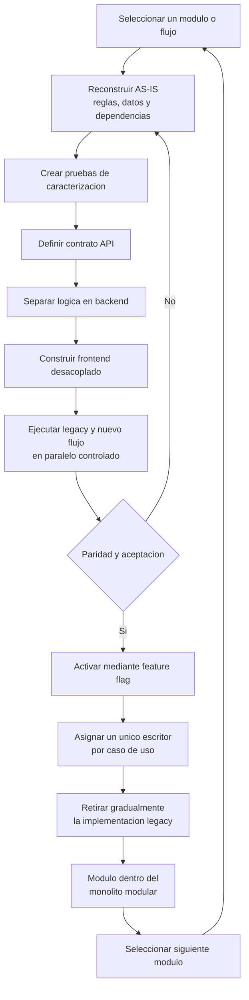
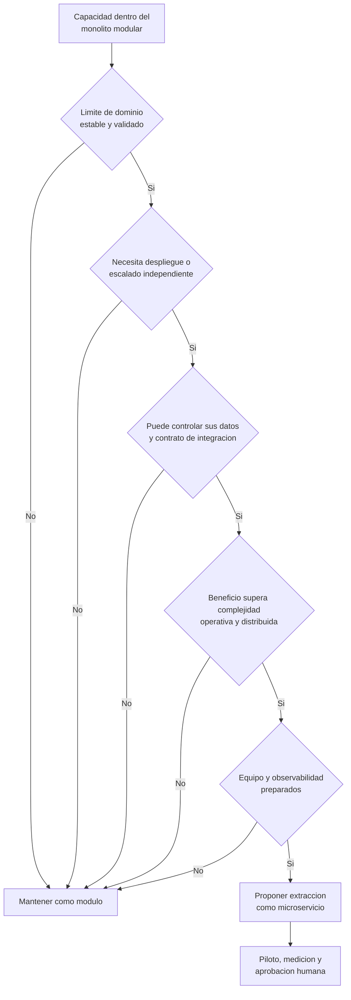
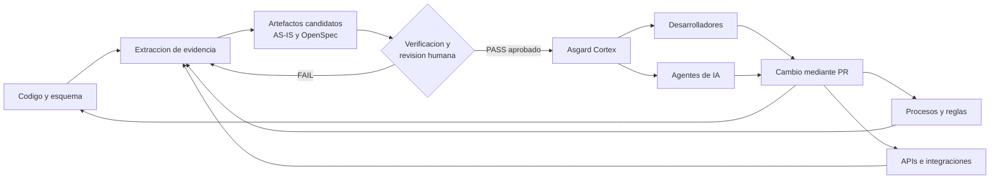

# Diagramas Mermaid - Plan de Refactorizacion de Asgard

Estado: BORRADOR DE APOYO, NO CANONICO.  
Fuente: `2026-08-10 Plan de Refactorizacion.docx`.  
Convencion: `❓` identifica decisiones pendientes de aprobacion.

## 1. Estrategia general de modernizacion

Ubicacion sugerida: despues del titulo o de la introduccion.  
Evidencia: PLAN-DOC-001, paginas 1, 4-6 y 9.

## 2. Entorno independiente de refactorizacion

Ubicacion sugerida: seccion 1, "Crear un entorno especifico".  
Evidencia: PLAN-DOC-002, pagina 1.

## 3. Desarrollo continuo mediante PR pequenos

Ubicacion sugerida: secciones 2, 5 y 6.  
Evidencia: PLAN-DOC-003, paginas 1-3.

## 4. Piloto de compatibilidad PHP 8.5

Ubicacion sugerida: seccion 7, "Realizar primero un piloto".  
Evidencia: PLAN-DOC-004, paginas 2-4. El bloque piloto sigue pendiente.

## 5. Promocion del runtime y rollback

Ubicacion sugerida: seccion 8, "Hacer el cambio de runtime".  
Evidencia: PLAN-DOC-005, pagina 4.

## 6. Coexistencia de legacy, backend y frontend modernos

Ubicacion sugerida: inicio de la segunda gran fase.  
Evidencia: PLAN-DOC-006, paginas 4-5. Laravel y Vue son candidatos razonables, pero la seleccion formal sigue pendiente.

## 7. Modernizacion modulo por modulo

Ubicacion sugerida: seccion 9, sustituyendo la lista vertical actual.  
Evidencia: PLAN-DOC-007, pagina 5.

## 8. Decision posterior sobre microservicios

Ubicacion sugerida: seccion 10, "Microservicios quedan para despues".  
Evidencia: PLAN-DOC-008, paginas 5-6. Los criterios de decision son TO-BE y requieren aprobacion.

## 9. Asgard Cortex como ciclo continuo

Ubicacion sugerida: seccion 11, "Crear y mantener vivo Asgard Cortex".  
Evidencia: PLAN-DOC-009, paginas 6-7.

## Matriz de trazabilidad

| ID | Contenido respaldado | Fuente |
| --- | --- | --- |
| PLAN-DOC-001 | Dos fases, PHP 8.5 antes de modularizacion y microservicios, Cortex paralelo | Documento, paginas 1, 4-6 y 9 |
| PLAN-DOC-002 | Entorno separado, alternativas de BD y dependencias externas | Documento, pagina 1 |
| PLAN-DOC-003 | Main activo, PR pequenos, guardarrailes y bloques controlados | Documento, paginas 1-3 |
| PLAN-DOC-004 | Piloto, caracterizacion, compatibilidad e integraciones | Documento, paginas 2-4 |
| PLAN-DOC-005 | Promocion refactorizacion, staging, produccion y rollback | Documento, pagina 4 |
| PLAN-DOC-006 | Backend API, frontend independiente y tecnologias candidatas | Documento, paginas 4-5 |
| PLAN-DOC-007 | Modernizacion progresiva modulo por modulo | Documento, pagina 5 |
| PLAN-DOC-008 | Microservicios diferidos hasta validar dominios | Documento, paginas 5-6 |
| PLAN-DOC-009 | Asgard Cortex como repositorio vivo y actualizado por incremento | Documento, paginas 6-7 |

