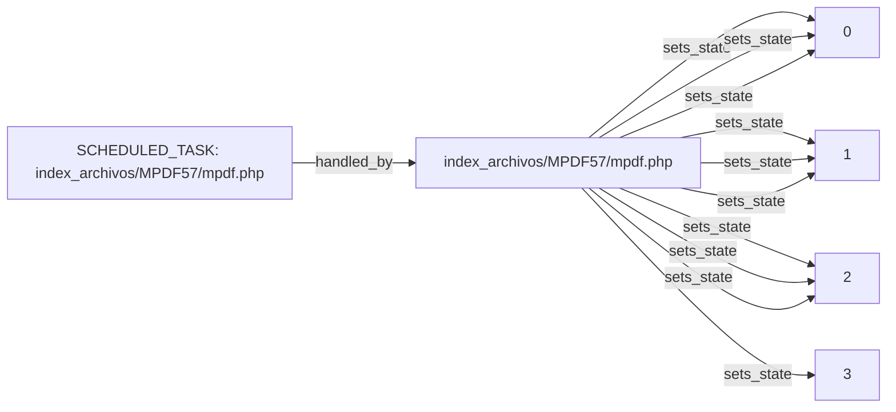

# Technical component map: `index_archivos/MPDF57/mpdf.php`

Status: `CANDIDATE_AS_IS`

> Relationships are observed or candidate-level in the same component and are not yet a confirmed execution sequence.

