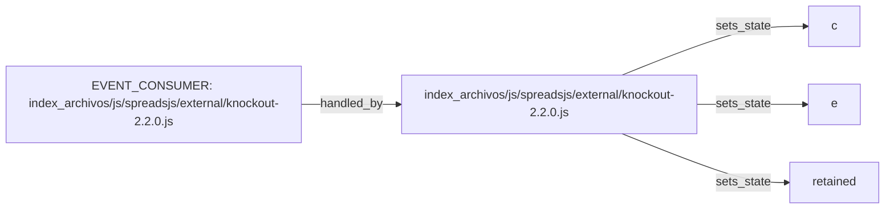

# Technical component map: `index_archivos/js/spreadsjs/external/knockout-2.2.0.js`

Status: `CANDIDATE_AS_IS`

> Relationships are observed or candidate-level in the same component and are not yet a confirmed execution sequence.

