# Technical component map: `index_archivos/libs/datatables/pdfmake-0.1.36/pdfmake.js`

Status: `CANDIDATE_AS_IS`

> Relationships are observed or candidate-level in the same component and are not yet a confirmed execution sequence.

```mermaid
flowchart LR
  Nd25b90ac4f1c["index_archivos/libs/datatables/pdfmake-0.1.36/pdfmake.js"]
  N752e80316ae6["SCHEDULED_TASK: index_archivos/libs/datatables/pdfmake-0.1.36/pdfmake.js"]
  Nb8d83dea9dec["-1"]
  N1e9863485105["0"]
  N762de2458a02["BUSY_STATE"]
  N4b0723977b9d["COMMENT_STATE"]
  Nc7937f3f0d08["EXTRA_STATE"]
  N11f7a8a025de["FINISH_STATE"]
  Nf87b15fe060c["GenStateCompleted"]
  Ned99dce1eaaa["GenStateExecuting"]
  N7d45aec04387["GenStateSuspendedStart"]
  Nd9046eb325da["HCRC_STATE"]
  Ne5f9218a48a2["INITIAL_STATE"]
  N6514530e6367["NAME_STATE"]
  N276ebcb177fb["_STATE_TABLE"]
  N88659245f2ff["arguments"]
  N4409a261df4d["context"]
  N830aa891bc74["new"]
  Neb6d4b2c5184["nextState"]
  N3c823c6219d1["null"]
  N3f1fb053d764["s"]
  N98c3d7dfcb34["self"]
  N21aa0a5a798e["src"]
  N917ee7df9460["state"]
  N80465fc86cfd["stream"]
  N528a0b8be85c["strm"]
  N0d43eeea99a9["this"]
  Nd25b90ac4f1c -- "sets_state" --> Nb8d83dea9dec
  Nd25b90ac4f1c -- "sets_state" --> N1e9863485105
  Nd25b90ac4f1c -- "sets_state" --> N1e9863485105
  Nd25b90ac4f1c -- "sets_state" --> N1e9863485105
  Nd25b90ac4f1c -- "sets_state" --> N762de2458a02
  Nd25b90ac4f1c -- "sets_state" --> N762de2458a02
  Nd25b90ac4f1c -- "sets_state" --> N762de2458a02
  Nd25b90ac4f1c -- "sets_state" --> N762de2458a02
  Nd25b90ac4f1c -- "sets_state" --> N4b0723977b9d
  Nd25b90ac4f1c -- "sets_state" --> N4b0723977b9d
  Nd25b90ac4f1c -- "sets_state" --> Nc7937f3f0d08
  Nd25b90ac4f1c -- "sets_state" --> N11f7a8a025de
  Nd25b90ac4f1c -- "sets_state" --> Nf87b15fe060c
  Nd25b90ac4f1c -- "sets_state" --> Nf87b15fe060c
  Nd25b90ac4f1c -- "sets_state" --> Ned99dce1eaaa
  Nd25b90ac4f1c -- "sets_state" --> N7d45aec04387
  Nd25b90ac4f1c -- "sets_state" --> Nd9046eb325da
  Nd25b90ac4f1c -- "sets_state" --> Nd9046eb325da
  Nd25b90ac4f1c -- "sets_state" --> Ne5f9218a48a2
  Nd25b90ac4f1c -- "sets_state" --> Ne5f9218a48a2
  Nd25b90ac4f1c -- "sets_state" --> N6514530e6367
  Nd25b90ac4f1c -- "sets_state" --> N6514530e6367
  Nd25b90ac4f1c -- "sets_state" --> N276ebcb177fb
  Nd25b90ac4f1c -- "sets_state" --> N276ebcb177fb
  Nd25b90ac4f1c -- "sets_state" --> N88659245f2ff
  Nd25b90ac4f1c -- "sets_state" --> N4409a261df4d
  Nd25b90ac4f1c -- "sets_state" --> N830aa891bc74
  Nd25b90ac4f1c -- "sets_state" --> Neb6d4b2c5184
  Nd25b90ac4f1c -- "sets_state" --> N3c823c6219d1
  Nd25b90ac4f1c -- "sets_state" --> N3c823c6219d1
  Nd25b90ac4f1c -- "sets_state" --> N3c823c6219d1
  Nd25b90ac4f1c -- "sets_state" --> N3c823c6219d1
  Nd25b90ac4f1c -- "sets_state" --> N3f1fb053d764
  Nd25b90ac4f1c -- "sets_state" --> N98c3d7dfcb34
  Nd25b90ac4f1c -- "sets_state" --> N98c3d7dfcb34
  Nd25b90ac4f1c -- "sets_state" --> N21aa0a5a798e
  Nd25b90ac4f1c -- "sets_state" --> N917ee7df9460
  Nd25b90ac4f1c -- "sets_state" --> N80465fc86cfd
  Nd25b90ac4f1c -- "sets_state" --> N80465fc86cfd
  Nd25b90ac4f1c -- "sets_state" --> N80465fc86cfd
  Nd25b90ac4f1c -- "sets_state" --> N80465fc86cfd
  Nd25b90ac4f1c -- "sets_state" --> N80465fc86cfd
  Nd25b90ac4f1c -- "sets_state" --> N528a0b8be85c
  Nd25b90ac4f1c -- "sets_state" --> N528a0b8be85c
  Nd25b90ac4f1c -- "sets_state" --> N528a0b8be85c
  Nd25b90ac4f1c -- "sets_state" --> N528a0b8be85c
  Nd25b90ac4f1c -- "sets_state" --> N528a0b8be85c
  Nd25b90ac4f1c -- "sets_state" --> N528a0b8be85c
  Nd25b90ac4f1c -- "sets_state" --> N528a0b8be85c
  Nd25b90ac4f1c -- "sets_state" --> N528a0b8be85c
  Nd25b90ac4f1c -- "sets_state" --> N528a0b8be85c
  Nd25b90ac4f1c -- "sets_state" --> N528a0b8be85c
  Nd25b90ac4f1c -- "sets_state" --> N0d43eeea99a9
  Nd25b90ac4f1c -- "sets_state" --> N0d43eeea99a9
  Nd25b90ac4f1c -- "sets_state" --> N0d43eeea99a9
  Nd25b90ac4f1c -- "sets_state" --> N0d43eeea99a9
  Nd25b90ac4f1c -- "sets_state" --> N0d43eeea99a9
  Nd25b90ac4f1c -- "sets_state" --> N0d43eeea99a9
  Nd25b90ac4f1c -- "sets_state" --> N0d43eeea99a9
  Nd25b90ac4f1c -- "sets_state" --> N0d43eeea99a9
  Nd25b90ac4f1c -- "sets_state" --> N0d43eeea99a9
  Nd25b90ac4f1c -- "sets_state" --> N0d43eeea99a9
  Nd25b90ac4f1c -- "sets_state" --> N0d43eeea99a9
  N752e80316ae6 -- "handled_by" --> Nd25b90ac4f1c
```

