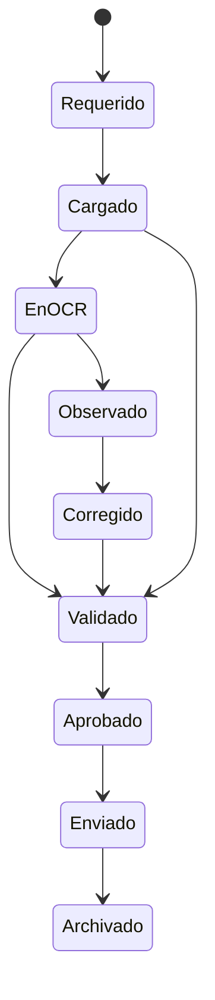

# Document lifecycle

Estado: candidate_reconstruction  
Confianza: media

## Variantes

Algunos documentos se generan internamente, otros se cargan por usuario/tercero y otros se derivan de OCR o descarga masiva. El ciclo exacto depende del dominio.
