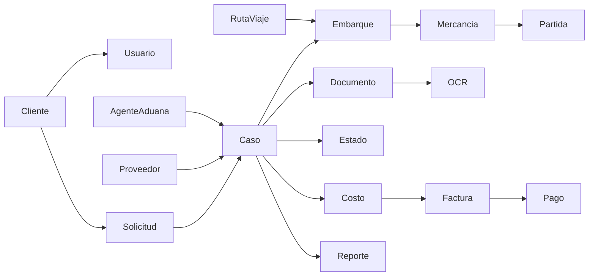

# Conceptual data model

Estado: candidate_reconstruction  
Confianza: media

## Lectura

El modelo conceptual se ha inferido desde nombres de tablas, dominios reconstruidos y endpoints. Las relaciones reales pueden estar implementadas mediante claves no declaradas, campos historicos o consultas manuales.
