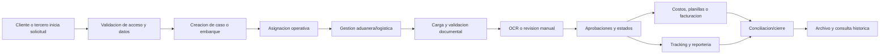

# End-to-end process map

Estado: candidate_reconstruction  
Confianza: media

## Excepciones transversales

Documentos faltantes, OCR inconsistente, datos de catalogo incompletos, permiso insuficiente, integracion fallida, duplicidad y estados invalidos.
