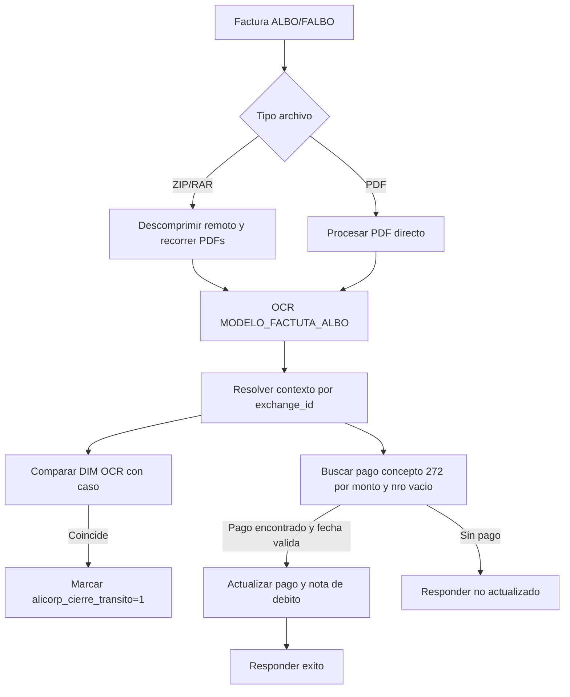

# Alicorp Albo OCR Payment Reconciliation - Process Flow

## Flujo principal candidato

1. El usuario solicita lectura OCR de factura ALBO/FALBO desde intercambio documental.
2. ASGARD determina si el archivo es PDF directo o paquete ZIP/RAR.
3. Si es paquete, descomprime en servidor remoto y procesa PDFs encontrados.
4. ASGARD ejecuta OCR con `MODELO_FACTUTA_ALBO`.
5. ASGARD extrae total, DIM, numero de factura y fecha.
6. ASGARD resuelve contexto por `exchange_id`:
   - Embarque logistico.
   - Solicitud aduanera previa.
   - Solicitud de asesoria gestion.
7. ASGARD busca un pago pendiente del concepto `272` con monto coincidente.
8. Si el DIM OCR coincide con un caso ASGARD, marca cierre de transito Alicorp.
9. Si hay pago y fecha valida, actualiza pago y nota de debito.
10. ASGARD devuelve mensaje de actualizacion o causa de no actualizacion.

## Excepciones observadas

- Si no hay contexto, responde que no existe el concepto cargado.
- Si no hay pago pendiente por monto/concepto, responde que no se cargo el pago o DIM incorrecto.
- Si la fecha no tiene formato esperado, responde formato incorrecto.
- En paquetes, la rama guarda metadata OCR; en PDF directo la metadata es mas limitada.

## Diagrama

