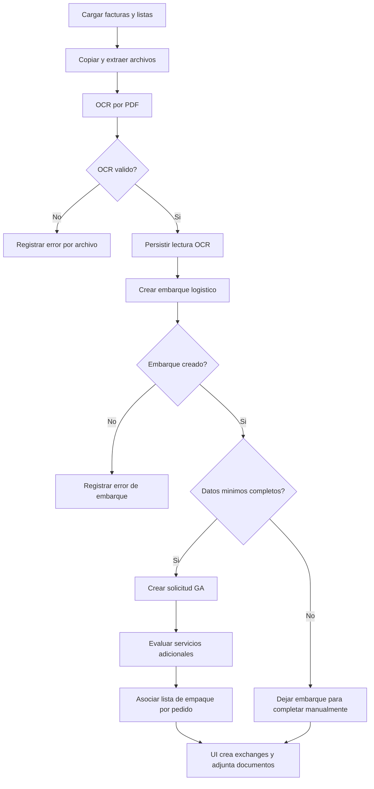

# Alicorp OCR Bulk Shipment Intake - Process Flow

## Flujo principal

1. El usuario abre la pantalla de logistica y el modal de carga masiva.
2. El usuario selecciona modalidad, linea, indicador `Todos OL`, facturas comerciales y lista de empaque.
3. La UI envia el formulario a `get-ocr-alicorp-masivo.php`.
4. ASGARD copia el ZIP/PDF de facturas en `/datadrive1/OCRAlicorp`.
5. Si es ZIP, ASGARD lo descomprime y toma los PDFs.
6. ASGARD copia y descomprime el ZIP de listas de empaque.
7. Para cada PDF, ASGARD ejecuta `lecturaOCRAlicorp`.
8. OCR persiste cabecera, detalle e importes internacionales.
9. ASGARD transforma datos OCR a los campos esperados por `embarquesController.php`.
10. ASGARD crea el embarque logistico.
11. Si faltan datos minimos, el embarque queda creado para completar manualmente y no se crea GA automatica.
12. Si los datos minimos estan completos, ASGARD arma datos de Gestion Aduanera.
13. ASGARD crea la solicitud aduanera asociada al embarque.
14. ASGARD evalua servicios adicionales candidatos por linea/proveedor/producto/peso.
15. ASGARD busca una lista de empaque cuyo nombre contenga el pedido y la asocia a la solicitud.
16. La UI procesa la respuesta por archivo.
17. La UI crea exchange logistico y adjunta documentos.
18. Si existe solicitud GA completa, la UI crea/mergea exchange aduanero y llama `actualizaridexchange.php`.
19. La UI muestra resultado masivo al usuario.

## Excepciones observadas

- ZIP de facturas no descomprimible: devuelve error general.
- PDF no cargable: devuelve error de carga.
- OCR con error: la fila de resultado muestra el mensaje de OCR.
- Embarque no creado: la fila de resultado muestra que no se pudo crear el embarque.
- Datos minimos incompletos (`sinData`): se crea embarque pero se informa que faltan datos para completar manualmente.
- Lista de empaque no emparejada por pedido: no se observa bloqueo del embarque/solicitud.

## Diagrama

