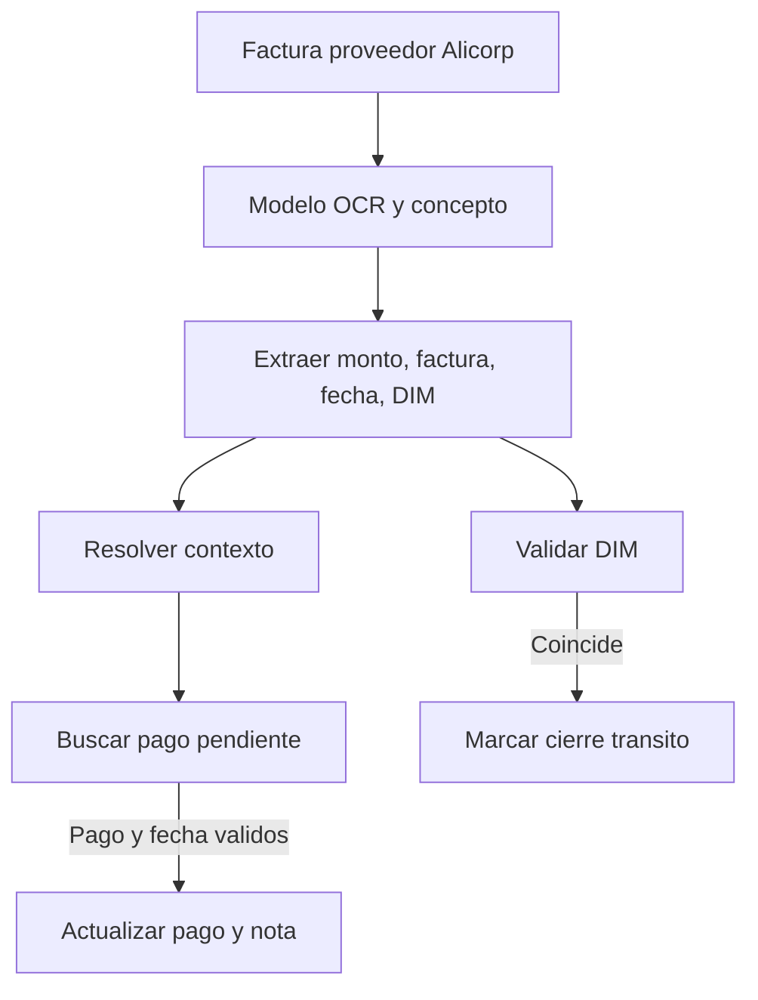

# Alicorp Supplier OCR Payment Reconciliation - Process Flow

1. El usuario ejecuta OCR sobre factura SENAVEX, FDAB o Jennefer.
2. ASGARD selecciona modelo y concepto.
3. ASGARD extrae monto, factura, fecha y DIM/DEX.
4. ASGARD resuelve contexto por `exchange_id`.
5. ASGARD busca pago pendiente por concepto, monto y numero vacio.
6. ASGARD marca cierre de transito si DIM coincide.
7. ASGARD actualiza pago y nota de debito cuando la fecha es valida.

