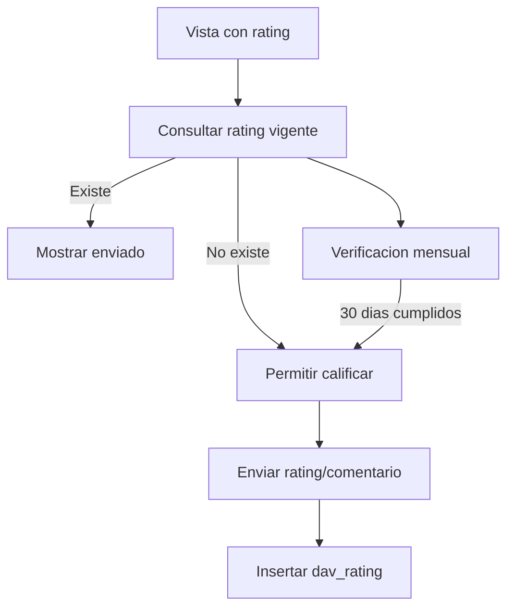

# Customer Shipment Rating Feedback - Process Flow

1. La vista carga el componente de rating con cliente, embarque, solicitud, caso y usuario.
2. ASGARD consulta si ya existe rating vigente.
3. Si existe, muestra la calificacion como enviada/solo lectura.
4. Para modal mensual, ASGARD calcula `created_at + 30 DAY`.
5. Si corresponde mostrar, el usuario selecciona estrellas y comentario.
6. ASGARD inserta `dav_rating` y responde exito.

