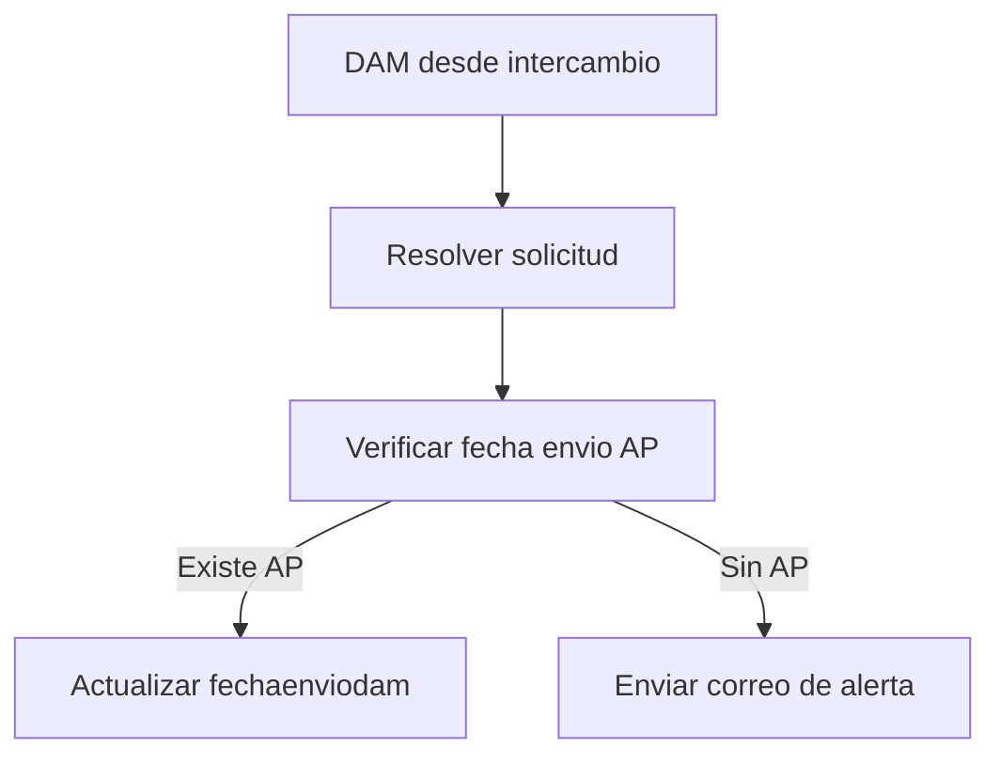

# Customs DAM Document Send Date Control - Process Flow

1. El usuario/proceso documental dispara procesamiento de DAM desde intercambio.
2. ASGARD localiza la solicitud por `exchange_id`.
3. ASGARD cuenta facturas comerciales con fecha de envio AP.
4. Si existe AP, actualiza `fechaenviodam` con la fecha actual.
5. Si no existe AP, envia correo informando que no se actualizo la fecha DAM.

