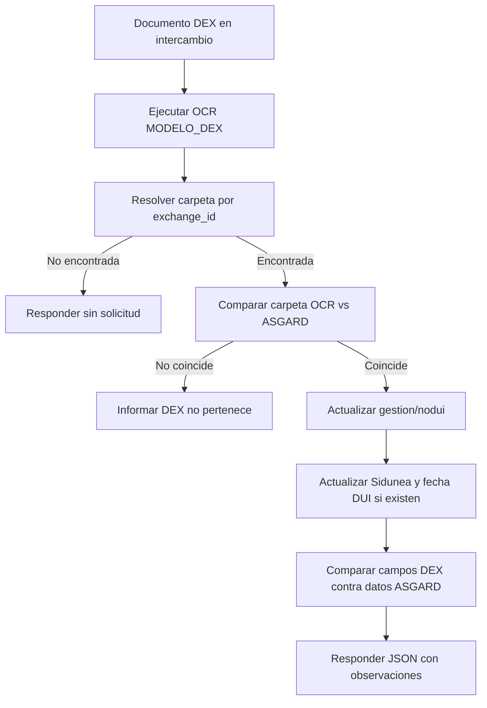

# Customs DEX OCR Validation Update - Process Flow

## Flujo principal candidato

1. El usuario solicita leer una DEX cargada en intercambio documental.
2. ASGARD construye la URL del documento y llama al modelo OCR DEX.
3. ASGARD resuelve la carpeta relacionada usando `exchange_id`.
4. Si no existe solicitud relacionada, responde que no existen solicitudes para el despacho.
5. Si existe solicitud, compara la carpeta OCR con la carpeta ASGARD.
6. Si la carpeta coincide, actualiza datos aduaneros del caso:
   - Gestion y numero DUI desde `declaracion`.
   - Numero Sidunea desde `sidunea`.
   - Fecha de validacion DUI desde `fecha_aceptacion`.
7. ASGARD contrasta campos DEX contra datos internos y acumula observaciones.
8. La respuesta JSON devuelve lectura OCR, campos relevantes y mensaje de diferencias.

## Excepciones observadas

- Si OCR falla, se devuelve el mensaje del lector.
- Si la carpeta OCR no corresponde, no se actualizan campos y se informa la diferencia.
- Si la declaracion no tiene el formato esperado, no se actualizan gestion/numero.
- Si la fecha OCR no tiene tres componentes, no se actualiza la fecha.

## Diagrama

