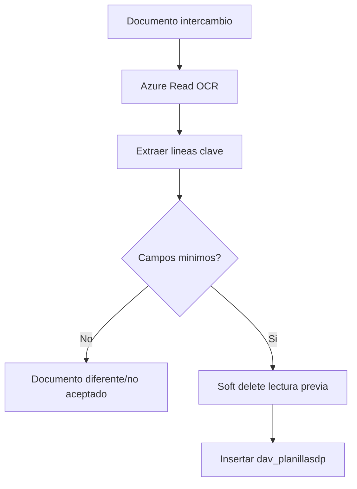

# Document Service Plan OCR Capture - Process Flow

1. El usuario solicita OCR del documento.
2. ASGARD envia la URL a Azure Read API.
3. ASGARD consulta el resultado hasta `succeeded` o timeout.
4. ASGARD recorre lineas para extraer numero, BL, monto y fechas.
5. Si los campos minimos existen, marca lecturas anteriores como eliminadas.
6. ASGARD inserta la nueva lectura en `dav_planillasdp`.

