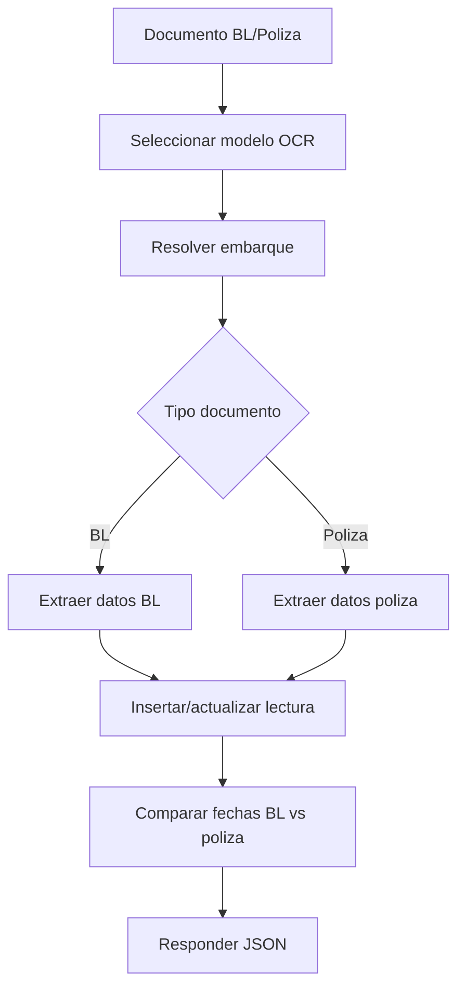

# Logistics BL Policy OCR Capture - Process Flow

1. El usuario ejecuta OCR sobre BL o poliza en intercambio documental.
2. ASGARD selecciona modelo OCR por `tipodoc`.
3. ASGARD localiza el embarque por `exchange_id`.
4. Si el documento es BL, extrae numero, operador, fecha y cantidad.
5. Si el documento es poliza, extrae numero, aplicacion, fecha, cantidad y valor.
6. ASGARD busca lectura existente por ubicacion o por cantidad complementaria.
7. Inserta o actualiza `logis_lecturablpoliza`.
8. Compara registros con BL y poliza completos y devuelve diferencias.

