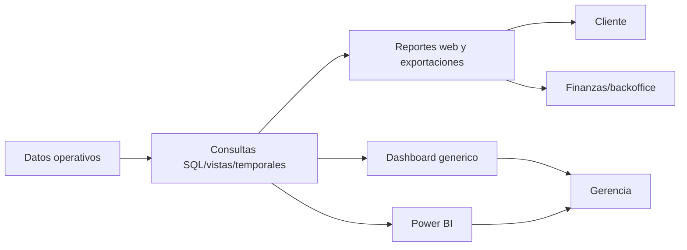

# Management information flows

Estado: candidate_reconstruction  
Confianza: media

## Controles necesarios

Definir ownership de metricas, filtros obligatorios, periodicidad, calidad de datos y reconciliacion entre reportes.
