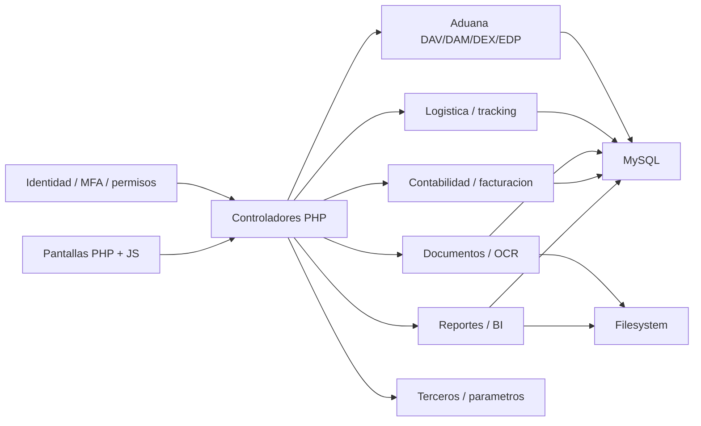

# Component Diagram AS-IS

Estado: INFERRED_DRAFT_REVIEW_REQUIRED
Idioma: Spanish

```mermaid
flowchart LR
  Auth["Identidad / MFA / permisos"] --> Core["Controladores PHP"]
  UI["Pantallas PHP + JS"] --> Core
  Core --> Customs["Aduana DAV/DAM/DEX/EDP"]
  Core --> Logistics["Logistica / tracking"]
  Core --> Docs["Documentos / OCR"]
  Core --> Billing["Contabilidad / facturacion"]
  Core --> Reports["Reportes / BI"]
  Core --> Third["Terceros / parametros"]
  Customs --> DB["MySQL"]
  Logistics --> DB
  Docs --> DB
  Billing --> DB
  Reports --> DB
  Docs --> FS["Filesystem"]
  Reports --> FS
```

Graphify confirma grafo amplio con miles de componentes y fuerte acoplamiento por includes/SQL compartido.
