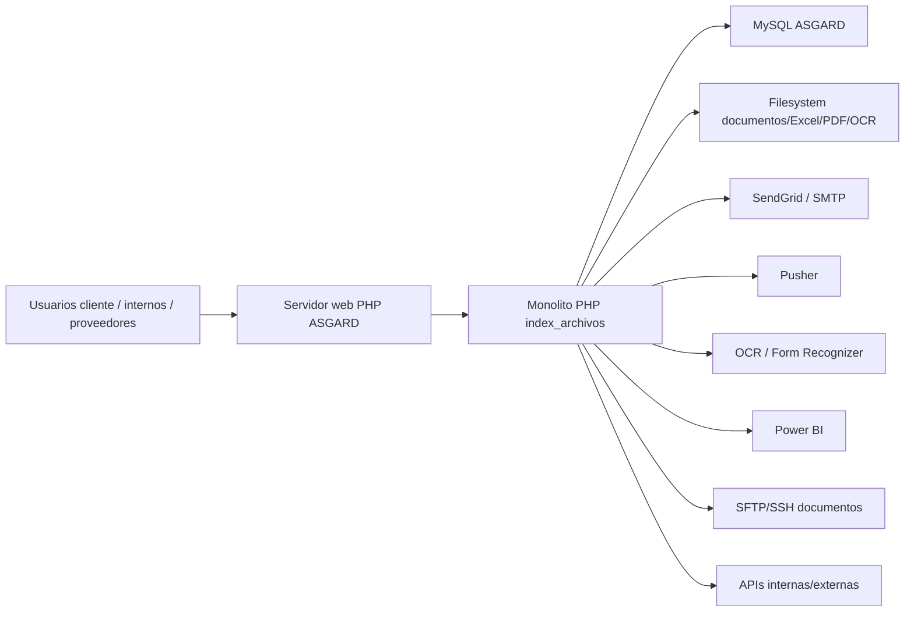

# Container Diagram AS-IS

Estado: INFERRED_DRAFT_REVIEW_REQUIRED
Idioma: Spanish

## Contenedores candidatos

| Contenedor | Tecnologia | Responsabilidad |
| --- | --- | --- |
| Web/PHP | PHP legacy, includes, AJAX | Render UI, ejecutar controladores, sesiones, permisos, SQL y ficheros. |
| Base de datos | MySQL | Persistencia transaccional/reporting. |
| Filesystem | Directorios bajo constantes | Documentos, adjuntos, OCR, Excel, PDFs y temporales. |
| Librerias locales | PHPMailer, SendGrid, mPDF, TCPDF, PHPExcel, JWT | Soporte transversal. |
| Servicios externos | HTTP/SFTP/Pusher/Power BI/OCR | Integraciones. |
