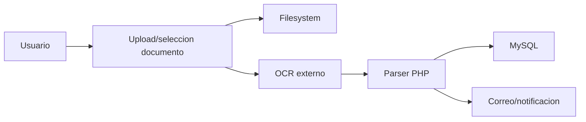
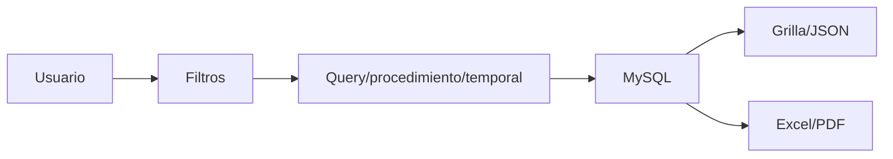

# Data Flow Diagrams

Estado: INFERRED_DRAFT_REVIEW_REQUIRED
Idioma: Spanish

## Flujo documento/OCR

```mermaid
flowchart LR
  U["Usuario"] --> UP["Upload/seleccion documento"]
  UP --> FS["Filesystem"]
  UP --> OCR["OCR externo"]
  OCR --> PHP["Parser PHP"]
  PHP --> DB["MySQL"]
  PHP --> MAIL["Correo/notificacion"]
```

## Flujo reporte

```mermaid
flowchart LR
  U["Usuario"] --> F["Filtros"]
  F --> Q["Query/procedimiento/temporal"]
  Q --> DB["MySQL"]
  DB --> Grid["Grilla/JSON"]
  DB --> XLS["Excel/PDF"]
```

## Flujo notificacion

```mermaid
flowchart LR
  Event["Evento negocio"] --> N["push_notificacion"]
  N --> NU["push_notificacionusuarios"]
  N --> P["Pusher"]
  P --> B["Browser toast"]
```
