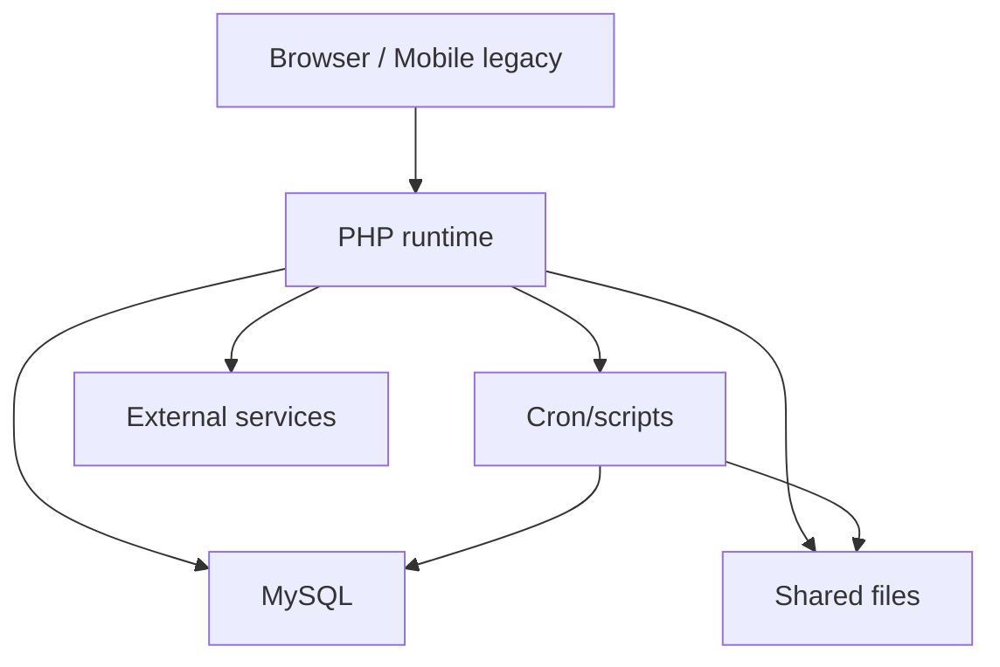

# Runtime Topology

Estado: INFERRED_DRAFT_REVIEW_REQUIRED
Idioma: Spanish

## Notas

- El runtime mezcla requests interactivos, reportes pesados y operaciones documentales.
- Algunas APIs legacy Android acceden directo a PHP.
- No se observa separacion de workers para OCR/Excel/PDF.
