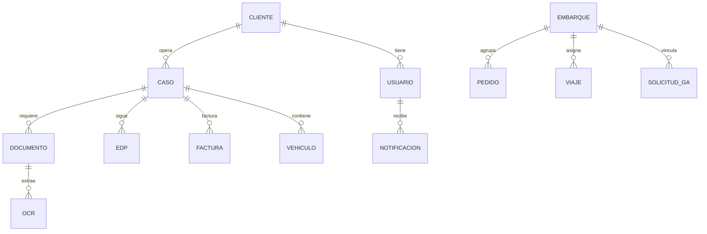

# Entity Relationship Diagram

Estado: INFERRED_DRAFT_REVIEW_REQUIRED
Idioma: Spanish

```mermaid
erDiagram
  CLIENTE ||--o{ USUARIO : tiene
  CLIENTE ||--o{ CASO : opera
  CASO ||--o{ DOCUMENTO : requiere
  CASO ||--o{ EDP : sigue
  CASO ||--o{ FACTURA : factura
  EMBARQUE ||--o{ PEDIDO : agrupa
  EMBARQUE ||--o{ VIAJE : asigna
  EMBARQUE ||--o{ SOLICITUD_GA : vincula
  CASO ||--o{ VEHICULO : contiene
  DOCUMENTO ||--o{ OCR : extrae
  USUARIO ||--o{ NOTIFICACION : recibe
```
